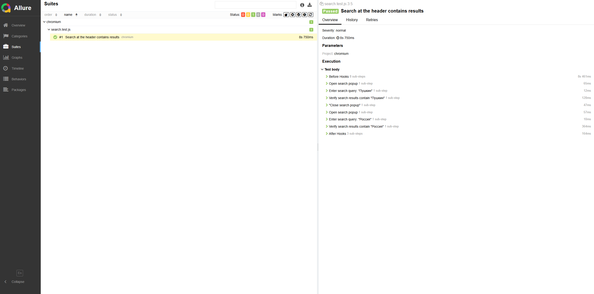

# qaguru-playwright-search
# **UI Autotest for Tretyakov Gallery Website**

This project contains automated test for verifying the search functionality on the [Tretyakov Gallery website](https://www.tretyakovgallery.ru/). The main goal of this test is to ensure the correct operation of the search system and support for repeated search queries.

## **Technologies**
- **JavaScript**
- **Playwright** - for browser automation and simulating interactions with UI elements

## **Project Structure**
- `tests/search.test.js`: Main test file for search functionality
- `pages/`: Page objects for centralized access to website elements
- `README.md`: Project documentation

## **Getting Started**
To set up and run the test, follow these steps:

1. **Clone the repository**:
   ```bash
   git clone <repository-url>
   cd qaguru-playwright-search
   ```

2. **Install dependencies**:
   Make sure Node.js is installed, then run:
   ```bash
   npm install
   ```

3. **Run the test**:
   ```bash
   npm run test
   ```

4. **View test results**:
   To view the report of test results, run:
   ```bash
   npm run allureReport
   ```

## **Test Description**
The main test verifies the search functionality on the website, including:

- **Initial search**: Entering and submitting a search query, verifying that correct results are displayed.
- **Repeated search**: Performing a new search with updated data to confirm that previous results reset and the display updates correctly.

## **Allure Report**
